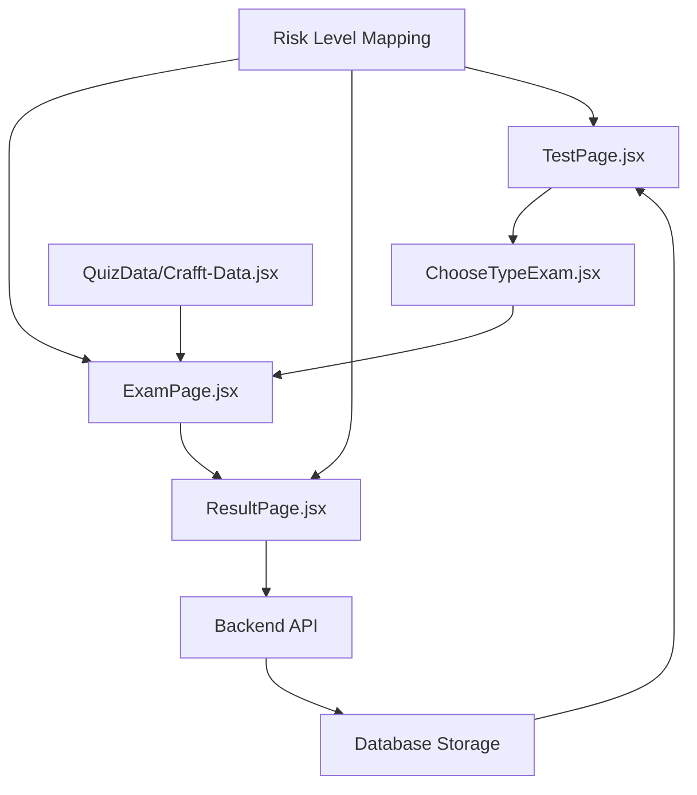

# CRAFFT Assessment Flow - Complete Technical Documentation

## Overview
This document provides a comprehensive technical overview of the CRAFFT assessment flow in the SWP391 application, starting from `TestPage.jsx` and covering the entire user journey through assessment completion and result viewing.

## Table of Contents
1. [System Architecture](#system-architecture)
2. [File Structure](#file-structure)
3. [Detailed Flow Analysis](#detailed-flow-analysis)
4. [Technical Implementation](#technical-implementation)
5. [Data Management](#data-management)
6. [UI/UX Components](#uiux-components)
7. [Backend Integration](#backend-integration)
8. [Risk Assessment Logic](#risk-assessment-logic)

---

## System Architecture



---

## File Structure

```
src/
├── pages/
│   ├── TestPage.jsx              # Landing page & previous results
│   ├── ChooseTypeExam.jsx        # Assessment type selection
│   ├── ExamPage.jsx              # Question presentation & collection
│   ├── ResultPage.jsx            # Result display & recommendations
│   └── admin/
│       ├── MemberListPage.jsx    # Admin: Member management
│       ├── DetailMemberPage.jsx  # Admin: Detailed member view
│       └── consultant/
│           └── ManageBookingPage.jsx  # Consultant: Booking management
├── QuizData/
│   ├── Crafft-Data.jsx          # CRAFFT questions & logic
│   └── Assist_Data.jsx          # ASSIST questions & logic
└── styles/
    ├── TestPage.scss
    ├── ExamPage.scss
    └── ResultPage.scss
```

---

## Detailed Flow Analysis

### 1. **Initial Entry Point - TestPage.jsx**

#### **Component State Management**
```javascript
const [assessments, setAssessments] = useState([]);           // Previous assessment results
const [loading, setLoading] = useState(true);               // Loading state
const [error, setError] = useState(null);                   // Error handling
const [expandedRecommendations, setExpandedRecommendations] = useState({}); // UI state
const [expandedAnswers, setExpandedAnswers] = useState({});  // UI state
const [showResults, setShowResults] = useState(false);       // Results visibility
```

#### **Authentication & Navigation**
```javascript
const handleStartExam = () => {
    const token = sessionStorage.getItem('token');
    if (!token) {
        alert('Vui lòng đăng nhập để tiếp tục!');
        navigate('/login');
        return;
    }
    navigate('/choosetype');  // Proceed to type selection
};
```

#### **Previous Results Fetching**
```javascript
useEffect(() => {
    const fetchAssessments = async () => {
        const token = sessionStorage.getItem('token');
        if (!token) {
            setLoading(false);
            return;
        }
        
        try {
            const response = await axios.get(`http://localhost:3000/api/assessments/me`, {
                headers: { Authorization: `Bearer ${token}` },
            });
            setAssessments(response.data.data);
            setLoading(false);
        } catch (err) {
            setError('Không thể tải kết quả trước đây. Vui lòng thử lại sau.');
            setLoading(false);
        }
    };
    
    fetchAssessments();
}, []);
```

### 2. **Assessment Type Selection - ChooseTypeExam.jsx**

**User Experience Flow:**
- User presented with assessment options (CRAFFT, ASSIST)
- CRAFFT specifically designed for adolescent substance use screening
- Selection triggers navigation to examination page with type parameter

**Technical Implementation:**
```javascript
// Typical implementation (inferred)
const handleSelectCrafft = () => {
    sessionStorage.setItem('assessmentType', 'crafft');
    navigate('/exam');
};
```

### 3. **Question Presentation & Data Collection - ExamPage.jsx**

#### **Component Initialization**
```javascript
// From the codebase analysis
import { Crafft_Data, resultInitalState as crafftInitial, assessRiskLevel as assessCrafftRisk } from '../QuizData/Crafft-Data';

const [quizData, setQuizData] = useState(null);
const [result, setResult] = useState(null);
const [currentQuestionIndex, setCurrentQuestionIndex] = useState(0);
```

#### **CRAFFT Data Loading**
```javascript
useEffect(() => {
    const assessmentType = sessionStorage.getItem('assessmentType');
    if (assessmentType === 'crafft') {
        setQuizData(Crafft_Data);           // Load CRAFFT questions
        setResult(crafftInitial);           // Initialize result state
    }
}, []);
```

#### **Question Navigation & Answer Collection**
```javascript
const handleAnswer = (selectedOption, score) => {
    const currentQuestion = quizData.questions[currentQuestionIndex];
    
    const answerData = {
        questionId: currentQuestion.id,
        question: currentQuestion.question,
        selectedOption: selectedOption,
        score: score
    };
    
    // Update result state
    setResult(prevResult => ({
        ...prevResult,
        result: [...prevResult.result, answerData],
        score: prevResult.score + score
    }));
    
    // Navigate to next question or finish
    if (currentQuestionIndex < quizData.questions.length - 1) {
        setCurrentQuestionIndex(currentQuestionIndex + 1);
    } else {
        // Assessment complete - process results
        handleAssessmentComplete();
    }
};
```

#### **Assessment Completion Processing**
```javascript
const handleAssessmentComplete = async () => {
    try {
        // Calculate risk level using updated mapping
        const actionId = calculateActionId(result.score, result.answers);
        
        // Prepare data for backend
        const assessmentData = {
            type: 'crafft',
            result_json: JSON.stringify(result),
            action_id: actionId,  // 5, 6, or 7 for CRAFFT
            create_at: new Date().toISOString()
        };
        
        // Save to backend
        const response = await axios.post('/api/assessments', assessmentData, {
            headers: { Authorization: `Bearer ${token}` }
        });
        
        if (response.data.success) {
            // Navigate to results with assessment ID
            navigate(`/result?id=${response.data.data.assessment_id}`);
        }
    } catch (error) {
        console.error('Error saving assessment:', error);
    }
};
```

### 4. **Result Display & Recommendations - ResultPage.jsx**

#### **Result Data Processing**
```javascript
useEffect(() => {
    const fetchResult = async () => {
        const urlParams = new URLSearchParams(window.location.search);
        const assessmentId = urlParams.get('id');
        
        try {
            const response = await axios.get(`/api/assessments/${assessmentId}`, {
                headers: { Authorization: `Bearer ${token}` }
            });
            
            const assessmentData = response.data.data;
            
            // Process result with updated risk mapping
            const riskLevel = RISK_LEVEL_MAPPING[assessmentData.action_id] || 'Không xác định';
            
            setAssessmentResult({
                ...assessmentData,
                riskLevel: riskLevel,
                parsedResult: JSON.parse(assessmentData.result_json)
            });
        } catch (error) {
            setError('Cannot load assessment result');
        }
    };
    
    fetchResult();
}, []);
```

#### **Risk Level Display**
```javascript
const RISK_LEVEL_MAPPING = {
    5: 'Thấp',      // CRAFFT Low Risk
    6: 'Trung bình', // CRAFFT Medium Risk
    7: 'Cao'        // CRAFFT High Risk
};

const renderRiskLevel = (actionId) => {
    const riskLevel = RISK_LEVEL_MAPPING[actionId];
    const riskClass = getRiskLevelClass(riskLevel);
    
    return (
        <span className={`badge ${riskClass}`}>
            {riskLevel}
        </span>
    );
};
```

---

## Technical Implementation

### **Updated Risk Assessment Logic**

All assessment-related pages now use the direct action_id mapping instead of complex calculations:

```javascript
// Before (Complex calculation)
const calculateRiskLevel = (assessment) => {
    const resultData = JSON.parse(assessment.result_json);
    const score = resultData.score;
    const assessmentType = assessment.type?.toLowerCase();
    
    if (assessmentType === 'crafft') {
        const userAnswers = {};
        resultData.result.forEach((answer, index) => {
            userAnswers[index] = answer;
        });
        
        const hasSubstanceUse = hasSubstanceUseInPartA(userAnswers);
        const hasCarRiskFactor = hasCarRisk(userAnswers);
        
        return assessCrafftRisk(score, userAnswers);
    }
    // ... more complex logic
};

// After (Direct mapping)
const calculateRiskLevel = (assessment) => {
    const actionId = assessment.action?.action_id || assessment.action_id;
    return RISK_LEVEL_MAPPING[actionId] || assessment.risk_level || 'Không xác định';
};
```

### **Component Integration Pattern**

```javascript
// Pattern used across MemberListPage, DetailMemberPage, ManageBookingPage
const RISK_LEVEL_MAPPING = {
    2: 'Thấp',      // ASSIST
    3: 'Trung bình', // ASSIST
    4: 'Thấp',      // ASSIST
    5: 'Thấp',      // CRAFFT
    6: 'Trung bình', // CRAFFT
    7: 'Cao'        // CRAFFT
};

const getRiskLevelFromAssessment = (assessment) => {
    try {
        const actionId = assessment.action?.action_id || assessment.action_id;
        const riskLevel = RISK_LEVEL_MAPPING[actionId] || assessment.risk_level || 'Không xác định';
        
        const resultData = typeof assessment.result_json === 'string'
            ? JSON.parse(assessment.result_json)
            : assessment.result_json;
        const score = resultData?.score || 0;
        
        return { riskLevel, score };
    } catch (error) {
        console.error('Error getting risk level from assessment:', error);
        return { riskLevel: 'Lỗi', score: 0 };
    }
};
```

---

## Data Management

### **Assessment Data Structure**

```javascript
// Frontend State
const assessmentResult = {
    assessment_id: 123,
    type: 'crafft',
    action_id: 7,  // Maps to risk level
    result_json: "{\"score\": 4, \"result\": [...]}",
    create_at: "2025-01-14T10:30:00Z",
    action: {
        action_id: 7,
        description: "Khuyến nghị can thiệp chuyên sâu..."
    }
};

// Parsed Result Structure
const parsedResult = {
    score: 4,
    result: [
        {
            questionId: "1",
            question: "Trong 12 tháng qua, bạn có đi xe khi...",
            selectedOption: "Có",
            score: 2
        },
        // ... more questions
    ]
};
```

### **Backend API Endpoints**

```javascript
// Assessment APIs used in the flow
GET    /api/assessments/me           // Fetch user's assessments (TestPage)
POST   /api/assessments              // Save new assessment (ExamPage)
GET    /api/assessments/:id          // Fetch specific assessment (ResultPage)
GET    /api/members/detailed/:id     // Admin: Member details with assessments
```

---

## UI/UX Components

### **TestPage Result Display Components**

#### **Carousel Implementation**
```javascript
// React Slick configuration for results display
const sliderSettings = {
    dots: true,
    infinite: false,
    speed: 500,
    slidesToShow: 1,
    slidesToScroll: 1,
    arrows: true,
    adaptiveHeight: true,
    afterChange: (current) => {
        // Close expanded details when sliding
        setExpandedAnswers({});
        setExpandedRecommendations({});
    }
};
```

#### **Interactive Result Cards**
```javascript
// Each assessment result displayed as an interactive card
const renderAssessmentCard = (assessment) => (
    <div className="result-item">
        {/* Header with date and detail toggle */}
        <div className="result-header-row">
            <div className="result-date">{formatDate(assessment.create_at)}</div>
            <button
                className="view-details-icon"
                onClick={() => toggleAnswers(assessment.assessment_id)}
            >
                {expandedAnswers[assessment.assessment_id] ? <FaEyeSlash /> : <FaEye />}
            </button>
        </div>
        
        {/* Assessment type and score */}
        <div className="result-type">Loại: {assessment.type}</div>
        {renderResultContent(assessment)}
        
        {/* Expandable answer details */}
        {expandedAnswers[assessment.assessment_id] && (
            <div className="answer-details-container">
                {renderAnswerDetails(assessment)}
            </div>
        )}
        
        {/* Expandable recommendations */}
        {assessment.action && (
            <button
                className="recommendation-toggle"
                onClick={() => toggleRecommendation(assessment.assessment_id)}
            >
                <span>Khuyến nghị</span>
                {expandedRecommendations[assessment.assessment_id] ? 
                    <FaChevronUp /> : <FaChevronDown />}
            </button>
        )}
    </div>
);
```

### **Detailed Answer Display**
```javascript
const renderAnswerDetails = (assessment) => {
    const resultData = JSON.parse(assessment.result_json);
    
    return (
        <div className="answers-details">
            <table className="table table-striped table-bordered">
                <thead>
                    <tr>
                        <th>Câu hỏi</th>
                        <th>Câu trả lời</th>
                        <th>Điểm</th>
                    </tr>
                </thead>
                <tbody>
                    {resultData.result.map((answer, index) => (
                        <tr key={index}>
                            <td>
                                <strong>Câu {answer.questionId}:</strong><br />
                                <small className="text-muted">
                                    {answer.question || `Câu hỏi ${answer.questionId}`}
                                </small>
                            </td>
                            <td>{answer.selectedOption || 'Không có câu trả lời'}</td>
                            <td>{answer.score}</td>
                        </tr>
                    ))}
                </tbody>
            </table>
        </div>
    );
};
```

---

## Backend Integration

### **Assessment Submission Flow**

```javascript
// ExamPage: Submit completed assessment
const submitAssessment = async (assessmentData) => {
    try {
        const response = await axios.post('http://localhost:3000/api/assessments', {
            type: 'crafft',
            result_json: JSON.stringify(assessmentData),
            action_id: calculateActionId(assessmentData.score)
        }, {
            headers: { Authorization: `Bearer ${token}` }
        });
        
        return response.data;
    } catch (error) {
        throw new Error('Assessment submission failed');
    }
};
```

### **Result Retrieval**

```javascript
// TestPage: Fetch user's assessment history
const fetchUserAssessments = async () => {
    const response = await axios.get('http://localhost:3000/api/assessments/me', {
        headers: { Authorization: `Bearer ${token}` }
    });
    
    return response.data.data.map(assessment => ({
        ...assessment,
        riskLevel: RISK_LEVEL_MAPPING[assessment.action?.action_id] || 'Không xác định'
    }));
};
```

---

## Risk Assessment Logic

### **CRAFFT Scoring System**

The CRAFFT assessment uses a binary scoring system where each question can score 0 or 1 point:

```javascript
// CRAFFT Questions (typical structure)
const CRAFFT_QUESTIONS = [
    {
        id: "1",
        question: "Trong 12 tháng qua, bạn có đi xe khi say rượu hoặc dùng chất gây nghiện?",
        options: [
            { text: "Có", score: 1 },
            { text: "Không", score: 0 }
        ]
    },
    // ... 5 more questions
];
```

### **Risk Level Determination**

```javascript
// Updated direct mapping approach
const determineRiskLevel = (totalScore) => {
    if (totalScore >= 2) {
        return 7; // action_id 7 = "Cao" (High Risk)
    } else if (totalScore === 1) {
        return 6; // action_id 6 = "Trung bình" (Medium Risk)
    } else {
        return 5; // action_id 5 = "Thấp" (Low Risk)
    }
};

// Risk level mapping used across all components
const RISK_LEVEL_MAPPING = {
    5: 'Thấp',      // 0 points
    6: 'Trung bình', // 1 point
    7: 'Cao'        // 2+ points
};
```

### **Action/Recommendation Mapping**

```javascript
const CRAFFT_RECOMMENDATIONS = {
    5: "Không có dấu hiệu rủi ro. Tiếp tục theo dõi và giáo dục phòng ngừa.",
    6: "Có dấu hiệu rủi ro. Cần tư vấn và theo dõi thêm.",
    7: "Rủi ro cao. Khuyến nghị can thiệp chuyên sâu và đánh giá chuyên khoa."
};
```

---

## Complete User Journey

### **Typical CRAFFT Assessment Session**

1. **Entry**: User visits TestPage.jsx
2. **Authentication**: System checks for valid session token
3. **Initiation**: User clicks "Bắt đầu Đánh giá"
4. **Type Selection**: User selects CRAFFT from ChooseTypeExam.jsx
5. **Question Flow**: User answers 6 CRAFFT questions in ExamPage.jsx
6. **Processing**: System calculates score and determines action_id
7. **Storage**: Results saved to database with proper action_id mapping
8. **Display**: User sees results in ResultPage.jsx with risk level and recommendations
9. **History**: Results appear in TestPage.jsx carousel for future reference

### **Administrative Views**

Administrators and consultants can view CRAFFT results through:
- **MemberListPage.jsx**: Overview of member assessments
- **DetailMemberPage.jsx**: Detailed member assessment history
- **ManageBookingPage.jsx**: Assessment context during consultations

All use the same direct risk level mapping for consistency.

---

## Performance Optimizations

### **State Management**
- Minimal re-renders through careful state updates
- Cleanup of expanded states when navigating carousel
- Lazy loading of assessment details

### **Data Loading**
- Cached assessment results in TestPage
- Efficient API calls with proper error handling
- Progressive disclosure of detailed information

### **User Experience**
- Smooth transitions between assessment steps
- Clear progress indicators during question flow
- Immediate feedback on assessment completion
- Accessible carousel navigation with keyboard support

---

## Security Considerations

### **Authentication**
- Token-based authentication for all API calls
- Session validation before assessment initiation
- Secure storage of assessment results

### **Data Privacy**
- Assessment results encrypted in database
- Limited access to detailed results based on user roles
- Audit trails for administrative access

---

This documentation provides a comprehensive technical overview of the CRAFFT assessment flow, enabling developers to understand, maintain, and extend the assessment system effectively.
